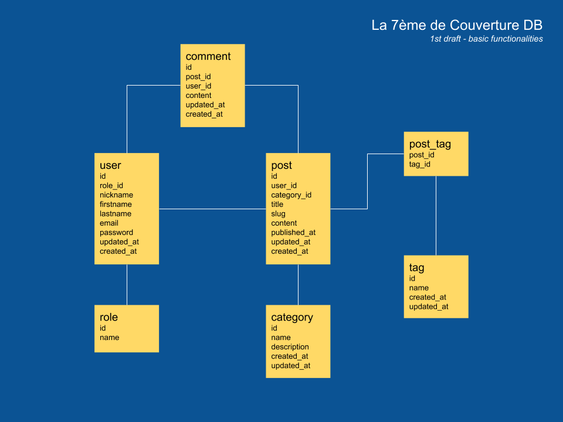

# La 7ème de Couverture Rest API

API & DB hosted on Heroku platforms

## API URL

https://powerful-escarpment-05124.herokuapp.com/

## Routes

### Categories

> **GET** /api/categories   > **GET** /api/categories/{id}   > **POST** /api/categories/   > **PUT** /api/categories/{id}   > **DELETE** /api/categories/{id}  

### Tags

> **GET** /api/tags   > **GET** /api/tags/{id}   > **POST** /api/tags/   > **PUT** /api/tags/{id}   > **DELETE** /api/tags/{id}  

### Roles

> **GET** /api/roles   > **GET** /api/roles/{id}   > **POST** /api/roles/   > **PUT** /api/roles/{id}   > **DELETE** /api/roles/{id}  

### Users

> **GET** /api/users   > **GET** /api/users/{id}   > **POST** /api/users/   > **PUT** /api/users/{id}   > **DELETE** /api/users/{id}  

### Posts

> **GET** /api/posts   > **GET** /api/posts/{id}   > **POST** /api/posts/   > **PUT** /api/posts/{id}   > **DELETE** /api/posts/{id}  

### Comments

> **GET** /api/comments   > **GET** /api/comments/{id}   > **POST** /api/comments/   > **PUT** /api/comments/{id}   > **DELETE** /api/comments/{id}  

## DB Schema

## Lumen PHP Framework

Laravel Lumen is a stunningly fast PHP micro-framework for building web applications with expressive, elegant syntax. We believe development must be an enjoyable, creative experience to be truly fulfilling. Lumen attempts to take the pain out of development by easing common tasks used in the majority of web projects, such as routing, database abstraction, queueing, and caching.

### Official Documentation

Documentation for the framework can be found on the [Lumen website](https://lumen.laravel.com/docs).

### Contributing

Thank you for considering contributing to Lumen! The contribution guide can be found in the [Laravel documentation](https://laravel.com/docs/contributions).

### Security Vulnerabilities

If you discover a security vulnerability within Lumen, please send an e-mail to Taylor Otwell at taylor@laravel.com. All security vulnerabilities will be promptly addressed.

### License

The Lumen framework is open-sourced software licensed under the [MIT license](https://opensource.org/licenses/MIT).
